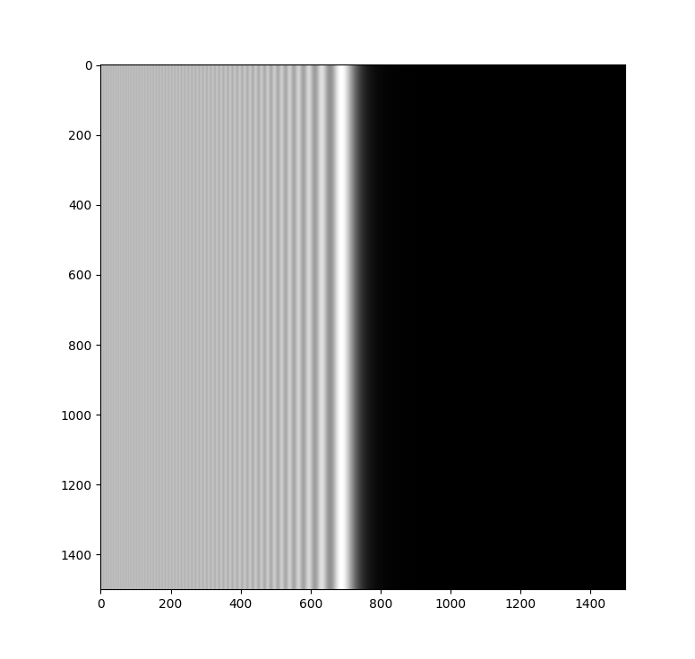
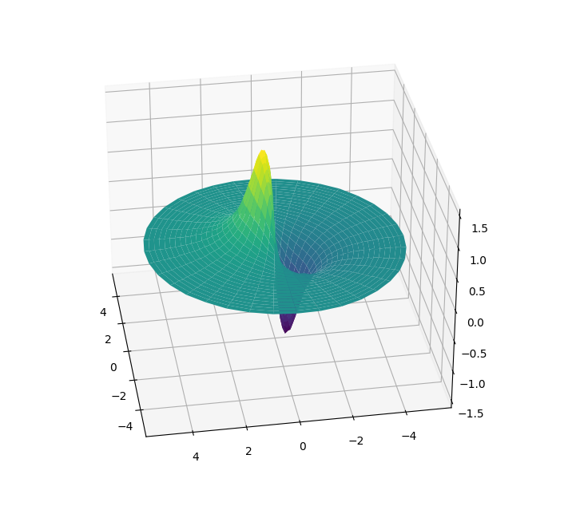
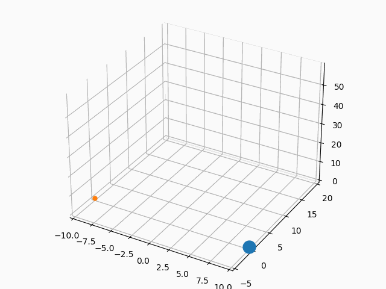
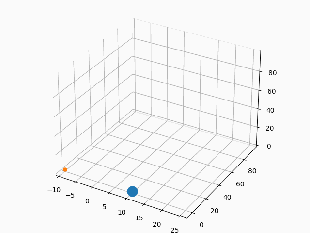
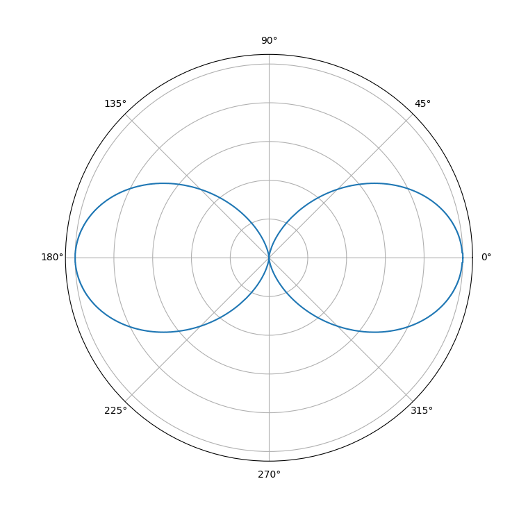
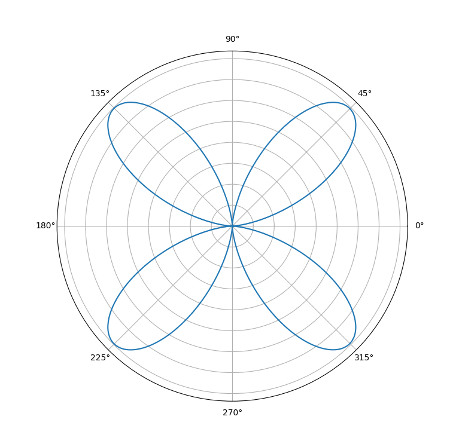

# Numerical Analysis

Codes for solving definite integrals, ODEs and PDEs using numerical analysis techniques and displaying the physical systems described by them.

## Definite Integrals

In the Simpson method, a quadratic polynomial is interpolated from sets of three consecutive points (of spacing h) and the areas under them are added up. The formula to approximate definite integrals by this method is

$\int_{x_1}^{x_N} f(x)dx = \cfrac{h}{3}(f(x_1) + 4f(x_2) + 2f(x_3) + 4f(x_4) + 2f(x_5) + \cdots + 2f(x_{N-2}) + 4f(x_{N-1}) + f(x_N))$

We can get the diffraction pattern from the parametric curve known as Cornu's spiral

$C(t) = \int_0^t \cos\left(\frac{\pi u^2}{2}\right) du$ 
$S(t) = \int_0^t \sin\left(\frac{\pi u^2}{2}\right) du$

with $t \in [-\infty,\infty]$.

The intensity due to diffraction at a sharp edge is plotted as

$I(t) = {\left(\frac{1}{2}-C(t)\right)}^2 + {\left(\frac{1}{2}-S(t)\right)}^2$

Another way of integration is the Monte Carlo method. The surface to be integrated is enclosed in a box. A large number of points are scattered at random. The proportion of points inside the surface to the total is equal to the proprtion of the area of the surface to that of the box.

The dipole potential of a disk lying in the x-y plane, with one half of positive charge and another half of negative charge, is

$V(\textbf{r}) = \cfrac{1}{4\pi\epsilon_0 r^2} \int r' \cos\theta \rho(\textbf{r}) d\tau'$

where

$d\tau'$ = infinitesimal volume of charged surface  
$r$ = distance of infinitesimal volume from origin  
$r'$ = distance of point of measurement from origin  
$\theta$ = angle between above two  
$\rho$ = charge distribution function

Using MC integration, we get the following plot for potential on the x-y plane

## Ordinary Differential Equations

The Runge Kutta method of order 4 can be used to solve an initial value ODE of the form $\cfrac{dy}{dx} = f(x,y)$ by constructing

$k_1 = f(x_n,y_n)$ 
$k_1 = f(x_n + \frac{h}{2},y_n + \frac{hk_1}{2})$ 
$k_1 = f(x_n + \frac{h}{2},y_n + \frac{hk_2}{2})$ 
$k_1 = f(x_n + h,y_n + hk_3)$

We get $y_{n + 1} = y_n + \cfrac{1}{6}(k_1 + 2k_2 + 2k_3 + k_4) + \mathcal{O}(h^5)$ and solve this iteratively.

The two body problem is a coupled second order system. Its governing differential equation is Newton's gravitational law

$\cfrac{d^2 \textbf{r}_1}{d t^2} = \cfrac{-Gm_2 \hat{\textbf{r}}_{12}}{|\textbf{r}_{12}|^2} = \cfrac{-Gm_2 (\textbf{r}_1 - \textbf{r}_2)}{|\textbf{r}_1-\textbf{r}_2|^3}$ 
$\cfrac{d^2 \textbf{r}_2}{d t^2} = \cfrac{-Gm_1 \hat{\textbf{r}}_{21}}{|\textbf{r}_{21}|^2} = \cfrac{-Gm_1 (\textbf{r}_2 - \textbf{r}_1)}{|\textbf{r}_2-\textbf{r}_1|^3}$ 

We can decouple the equations by considering $y_1 = \textbf{r}_1, y_2 = \textbf{r}_2, y_3 = \dot{\textbf{r}_1}, y_4 = \dot{\textbf{r}_2}$. Thus, we can see that

$\dot{y_1} = y_3$ 
$\dot{y_2} = y_4$ 
$\dot{y_3} = \cfrac{-Gm_2 (y_1 - y_2)}{\left(\sqrt{(y_{1x} - y_{2x})^2 + (y_{1y} - y_{2y})^2 + (y_{1z} - y_{2z})^2}\right)^3}$ 
$\dot{y_4} = \cfrac{-Gm_1 (y_2 - y_1)}{\left(\sqrt{(y_{1x} - y_{2x})^2 + (y_{1y} - y_{2y})^2 + (y_{1z} - y_{2z})^2}\right)^3}$

We solve them using the RK method with $k_{11} = f_1(x_n,y_{1n},y_{2n}), k_21 = f_2(x_n,y_{1n},y_{2n})$, and so on for $k_{12}, k_{22}$, etc. The function returns updated position and velocity vectors.

As an example, initially we take the positions as $\textbf{r}_1 = 10\hat{x}, \textbf{r}_2 = -10\hat{x}$ and their corresponding velocities as $\textbf{v}_1 = 0.1\hat{y} + 0.1\hat{z}, \textbf{v}_2 = -0.1\hat{y}$. (Note: We take G = 1)

Below plotted are the trajectories of the particles for $m_1 = 1.1, m_2 = 0.8$

We again plot for $m_1 = 1.1, m_2 = 0.008$. As expected, if one of the masses is much heavier than the other, the smaller particle revolves around the bigger one.

For the ODE $y''=f(x,y,y')$, given $a < x < b$, the boundary conditions are defined as $y(a)=y_a$ and $y(b)=y_b$. The shooting method is used to convert the boundary value problem to an initial value problem with initial conditions $y(a)=y_a$ and $y'(a)=\alpha^{(k)}$, where $\alpha^{(k)}$ is such that it satisfies $y(b)=y_b$.

$\alpha^{(0)}$ is initially chosen as the slope between points $(a,y_a)$ and $(b,y_b)$. This trial $\alpha$ is passed as the argument $y_b$ to the Runge-Kutta function, which returns a vector $y$ whose last element is an updated value of $y_b$.

Now, we must solve for $\alpha^{(k)}$ iteratively until $y_b^{(k)}$ is within the margin of error of the actual $y_b$. The recurrence relation is given by comparing slopes

$\alpha^{(k)} = \alpha^{(k-2)} + (y_b - y_b^{(k-2)})\cfrac{\alpha^{(k-1)} - \alpha^{(k-2)}}{y_b^{(k-1)} - y_b^{(k-2)}}$

The hydrogen wavefunction is $\Psi(r,\theta,\phi) = R(r)\Theta(\theta)\Phi(\phi)$. The azimuthal shape of the orbital with quantum numbers l and m is given by $\Theta(\theta) = P_{lm}(\cos\theta)$, which is the solution of the associated Legendre equation 

$(1-x^2)\cfrac{d^2}{d x^2} P_{lm}(x) - 2x\cfrac{d}{dx} P_{lm}(x) + \left(l(l + 1) - \cfrac{m^2}{1-x^2}\right) P_{lm}(x) = 0$

with boundary conditions $y(-1)=(-1)^n$ and $y(1)=1$.

We map $x \mapsto \cos\theta$ plot the square of the associated Legendre polynomial to get the electron density distribution.

This is the orbital shape of $p_z$, i.e. l=1, m=0.

And this is the orbital shape of $d_{xz}$, i.e. l=2, m=1.

## Partial Differential equations

To solve PDEs we use the finite difference method, in which spatial and temporal discretization is done.

We use this method to solve the heat equation for a spherical body. A metal ball at room temperature (25 degrees Celcius) is immersed in boiling water (100 degrees Celsius) till the temperature at the center is 40 degrees Celsius. The equation governing heat flow is given by

$\cfrac{1}{r^2}\cfrac{\partial}{\partial r}\left(r^2 \cfrac{\partial{T}}{\partial r}\right) = \cfrac{\rho c}{K} \cfrac{\partial T}{\partial t} \implies \cfrac{\partial T}{\partial t} = a\left(\cfrac{\partial ^2 T}{\partial r^2} + \cfrac{2}{r}\cfrac{\partial T}{\partial r}\right)$ where $a = \cfrac{K}{\rho c}$

Initially $T_{\forall r,t=0} = T_{\text{room}}$ and at the boundary $T_{r=R,\forall t} = T_{\text{water}}$

Now, after applying the finite difference method, we get

$\cfrac{T_{r,t + 1} - T_{r,t}}{ak} = \cfrac{2}{r}\left(\cfrac{T_{r + 1,t} - T_{r-1,t}}{2h}\right) + \cfrac{T_{r + 1,t} - 2T_{r,t} + T_{r-1,t}}{h^2} \implies T_{r,t + 1} = (1-2\alpha)T_{r,t} + \cfrac{\alpha}{r}\left((r-1)T_{r-1,t} + (r + 1)T_{r + 1,t} \right)$ where $\alpha = \cfrac{ak}{h^2}$

Using the finite difference method, we can also solve the wave equation for a string with a mass bead on it (located at three-fourths of its length from the left end) and show the reflection and tranmission of waves caused by it.

$\cfrac{\partial ^2 y}{\partial x^2} = \cfrac{1}{c^2}\cfrac{\partial ^2 y}{\partial c^2}$

The initial wave is of Gaussian nature given by $y_{x\in(-1,1),t=0} = e^{\frac{-1}{1-x^2}}$. It is given a right moving velocity as $\cfrac{1}{c}\cfrac{\partial y}{\partial x} = \cfrac{2xy}{(1-x^2)^2}$.

We discretize the equation, with an extra condition relating to the mass bead 

$m_{\text{bead}} \left(\cfrac{y_{x,t + 1} - 2y_{x,t} + y_{x,t-1}}{k^2}\right) = -T\sin\theta_1 + T\sin\theta_2 \approx -T\tan\theta_1 + T\tan\theta_2 = -T\left(\cfrac{y_{x,t} - y_{x-1,t}}{h}\right)+ T\left(\cfrac{y_{x + 1,t} - y_{x,t}}{h}\right)$

